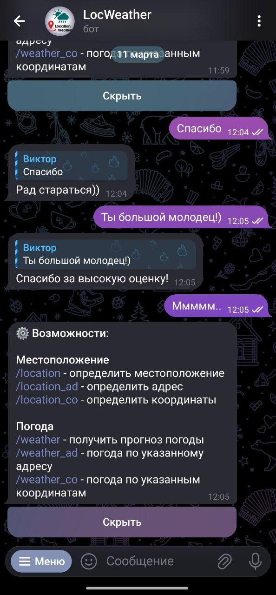
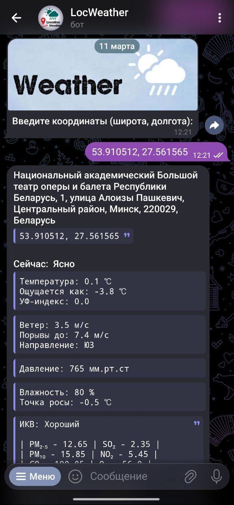
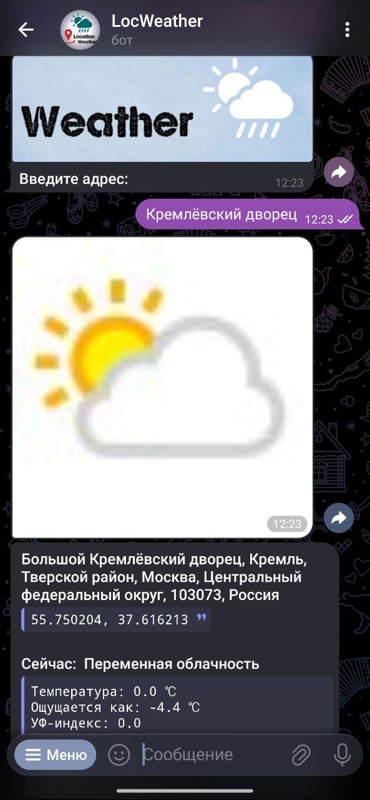
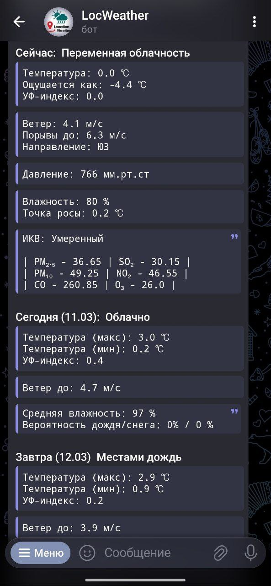
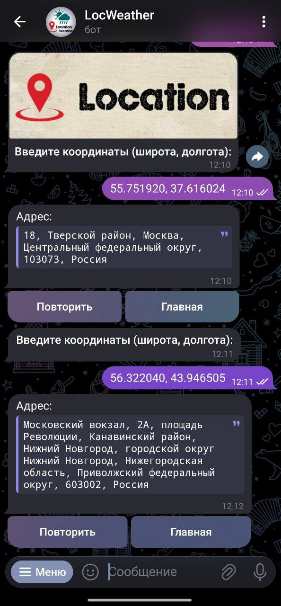
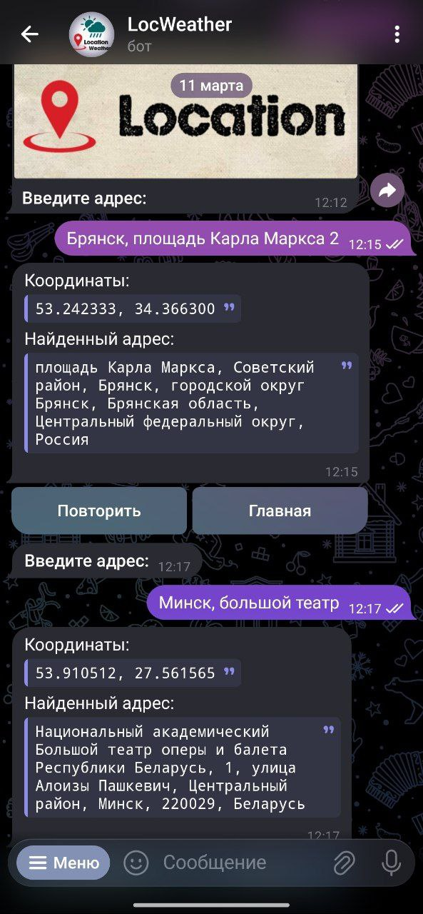

## LocWeather | Telegram Bot

### Описание
Бот предназначен для определения местоположения и получения данных о погоде в любой точке мира. 

> [!TIP]
> Помимо команд, бот реагирует на приветствие, благодарность и похвалу.

### Технологии
- Создан с помощью: ***Telebot (pyTelegramBotAPI)***.  
- Сервисы предоставления данных: ***rapidapi.com***, ***geocode.maps.co***, ***weatherapi.com***.  
- Хранение данных: ***SQLite3 + Peewee ORM***.  
- Кэширование запросов: ***Redis***.  
- Логирование приложения: ***Loguru***.  
- Проверка форматирования: ***flake8 + wemake-python-styleguide***.  
- Проверка аннотаций: ***Pylance***.  

### Скриншоты

<table>
  <tr>
    <td height="300" widht="auto">
      
      
Старт

    </td>
    <td height="300" widht="auto">
      
      
Приветствие

    </td>
    <td height="300" widht="auto">
      
      
Диалог

    </td>
  </tr>
  <tr>
    <td height="300" widht="auto">
      
      
Погода по координатам

    </td>
    <td height="300" widht="auto">
      
      
Погода по адресу

    </td>
    <td height="300" widht="auto">
      
      
Прогноз на три дня

    </td>
  </tr>
  <tr>
    <td height="300" widht="auto">
      
      
Место по координатам

    </td>
    <td height="300" widht="auto">
      
      
Координаты по адресу

    </td>
    <td height="300" widht="auto">
      
      
Проверка координат

    </td>
  </tr>
</table>

 

##### Команды:  
`/location` - Информация о местоположении  
`/loc_ad` - Определить адрес по координатам  
`/loc_co` - Получить координаты по указанному адресу  

`/weather` - Информация о погоде  
`/w_ad` - Погода по указанному адресу  
`/w_co` - Погода по указанным координатам  

 
 
 

  

